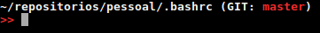

<<<<<<< HEAD
# .bashrc (Colored terminal and Aliases)

Colored terminal by Rafael Dias:



## Download
Make download of file .bashrc, paste and replace into your personal folder. 

(Or just copy the content from .bashrc and paste/replace inside your .bashrc)

local: ```/home/user/.bashrc```

## Credits
Template from [Thiago Nalli Valentim](http://www.diolinux.com.br/2014/09/como-personalizar-o-seu-terminal-linux.html).
=======
# my-bashrc
My .bashrc template
>>>>>>> 0b07a9a4b67102880fb4c221f02d3a13ddccdc3e
